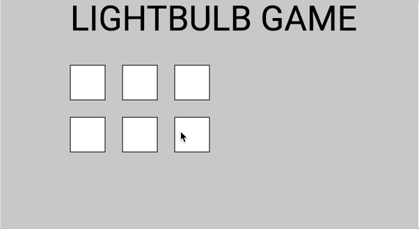

# Lightbulb Project

Congratulations! Your great aunt’s second cousin twice removed has recently left you a spooky old house. This is great, because…free house. As you can imagine, however, this does come with its fair share of problems, because spooky, and old.

The biggest problem your great aunt’s second cousin twice removed’s attorney warns you about when handing over the deed is that the wiring in the house is pretty old and nonsensical. Sometimes, a light switch controls multiple lights: it might turn more than one light on at a time, and will also turn some lights off. 

Because the house is spooky, you need to figure out how to turn all of the lights on as quickly as possible.

## Project Expectations
**GOAL**: Create a p5 program where each switch turns a combination of lights on and/or off. Some may turn on/off one light. Some may turn on/off many lights!

Your final project must:
- Contain *at least* 6 clickable buttons
- Each button should turn on and/or off some combination of lights. Some may turn on/off one light. Some may turn on/off many lights!
- Add any necessary design elements to make this game look appealing!
- **BONUS POINTS STRETCH #1**: Figure out how to draw a new background and “scene” if you win, so that the player knows they have completed the challenge.
- **BONUS POINTS CHALLENGE #2**: Figure out how to keep score, and make something happen if the user has clicked too many times without solving the puzzle.